# VidyaDesk ERP Complete System Report

Generated: 2026-05-21  
Scope: Read-only full-project audit of Flask, MongoDB, Jinja templates, static CSS/JS, routes, services, utilities, deployment configuration, data flows, user flows, performance, security, and maintainability.

Update note: The report now also includes post-audit implementation changes made on 2026-05-21, including login UI updates, payment-mode dashboard behavior changes, and removal of two demo receipt records from MongoDB.

## Table Of Contents

1. [Executive Summary](#1-executive-summary)
2. [Complete Project Architecture](#2-complete-project-architecture)
3. [Complete Routes Analysis](#3-complete-routes-analysis)
4. [Complete Feature Breakdown](#4-complete-feature-breakdown)
5. [Complete Database Analysis](#5-complete-database-analysis)
6. [Complete Frontend Analysis](#6-complete-frontend-analysis)
7. [Complete User Flows](#7-complete-user-flows)
8. [Performance Audit](#8-performance-audit)
9. [Security Audit](#9-security-audit)
10. [Code Quality And Maintainability](#10-code-quality-and-maintainability)
11. [Visual Documentation](#11-visual-documentation)
12. [Final Technical Summary](#12-final-technical-summary)

---

## 1. Executive Summary

VidyaDesk ERP is a school or institute finance-management web application. Its primary purpose is to manage student admissions, reusable and manual fee structures, fee collection receipts, student lifecycle actions, and finance/reporting dashboards.

### Recent Implementation Updates

The following changes were applied after the original audit:

| Area | Update |
|---|---|
| School login UI | `templates/auth/login.html` was restyled to match the existing super-admin login card pattern using `auth-shell`, `erp-panel`, `auth-card`, the VidyaDesk brand row, compact title text, and matching Bootstrap button styling. |
| Admin panel link | The school login page now shows the Admin Panel link as a polished pill action with a shield icon via `.auth-admin-link` in `static/css/app.css`. |
| Payment-mode dashboard cards | `services/report_service.py:payment_mode_dashboard_summary` keeps the five expected cards: Cash, UPI, Bank Transfer, Card, and Cheque. Each card initializes at zero and is filled dynamically from matching receipt records for the selected filters. Unknown/custom modes are ignored for these five fixed cards. |
| Recent transaction data cleanup | Two demo-like records were confirmed to be database records, not hard-coded template values: `REC-2026-0001` for `Abc` and `REC-2026-9281` for `Sai Verma`. Both were deleted through `services.payment_service.delete_receipt`, which removed matching `receipts` and `payments` records and recalculated linked student totals. |

Verification performed after these updates:

- `python -m compileall app.py routes services utils`
- Flask app startup via `python app.py`
- Database verification confirmed `receipts=0` and `payments=0` for `REC-2026-0001` and `REC-2026-9281`.

### What The Project Does

The system supports:

| Area | Capability |
|---|---|
| Authentication | Admin login/logout with Flask session cookies |
| Dashboard | Student counts, fee summaries, payment mode analytics, charts, exports |
| Students | Add/edit/view/delete students, search/filter, profile drawer, lifecycle status |
| Promotions | Promote one student or bulk-promote students while preserving history |
| Fee Structure | Create standard or manual/custom reusable fee structures with dynamic fee heads |
| Fee Assignment | Assign an existing structure by academic year or create student-specific manual fee heads |
| Receipts | Create partial-payment receipts, validate overpayment, print/download PDFs |
| Reports | Admissions, receivable, collections, discounts, fee structure, pending dues, history, exports |
| Academic Year | Global year switcher, generated academic-year options, historical fee assignment |
| Deployment | Vercel Python serverless, MongoDB Atlas, static CDN caching, optional compression |

### Technology Stack

| Layer | Technology |
|---|---|
| Backend | Python Flask 3.0.3 |
| Database | MongoDB via Flask-PyMongo |
| Frontend Rendering | Jinja templates |
| Styling | Bootstrap 5, Bootstrap Icons, custom `static/css/app.css` |
| Client JS | Vanilla JavaScript in `static/js/app.js`, Bootstrap JS, Chart.js usage if loaded |
| PDF/Excel | ReportLab, OpenPyXL |
| Deployment | Vercel with `@vercel/python` |
| Configuration | `.env`, `config.py`, `vercel.json` |

### Core Modules

| Module | Primary Files |
|---|---|
| App bootstrap | `app.py`, `config.py`, `extensions.py` |
| Auth | `routes/auth_routes.py`, `utils/auth.py`, `templates/auth/login.html` |
| Dashboard | `routes/dashboard_routes.py`, `templates/dashboard/index.html`, `services/report_service.py` |
| Students | `routes/student_routes.py`, `templates/students/*`, `services/fee_service.py` |
| Fees | `routes/fee_routes.py`, `templates/fee_structure/index.html`, `services/fee_service.py` |
| Receipts | `routes/receipt_routes.py`, `templates/receipts/*`, `services/payment_service.py` |
| Reports | `routes/report_routes.py`, `templates/reports/*`, `services/report_service.py` |
| Utilities | `utils/helpers.py`, `utils/pdf_generator.py`, `utils/performance.py` |
| Frontend | `templates/base.html`, `static/js/app.js`, `static/css/app.css` |

### Overall Architecture Summary

The application is a modular Flask monolith. `app.py` creates a Flask app, loads `Config`, initializes a global `PyMongo` extension, registers blueprints, injects shared template helpers, and performs lazy one-time runtime bootstrapping for defaults and indexes.

The backend is route-driven. Routes delegate domain logic to services:

- `fee_service.py` resolves fee structures, manual fee heads, fee totals, legacy compatibility fields, and student fee sync.
- `payment_service.py` creates/deletes receipts and recalculates student payment summaries.
- `report_service.py` produces dashboard/report metrics with a mix of MongoDB aggregations and projections.

The frontend uses server-rendered Jinja pages with progressive JavaScript for dynamic fee-head builders, dropdown loading, receipt previews, profile drawers, modals, bulk promotion, and charts.

### Deployment Summary

`vercel.json` maps all application traffic to `app.py`, configures static asset caching, and sets the Python serverless function memory and duration. MongoDB client creation is configured for serverless-style lazy connection behavior through `MONGO_CONNECT = False`. Static assets are cacheable through Vercel/CDN headers.

### High-Level Data Flow

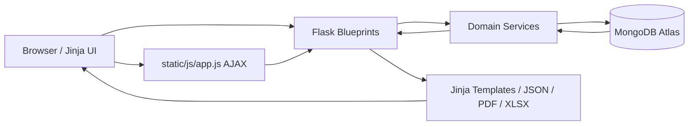

---

## 2. Complete Project Architecture

### Folder Structure

```text
VidyaDesk/
├── app.py
├── config.py
├── extensions.py
├── requirements.txt
├── vercel.json
├── routes/
│   ├── auth_routes.py
│   ├── dashboard_routes.py
│   ├── fee_routes.py
│   ├── receipt_routes.py
│   ├── report_routes.py
│   └── student_routes.py
├── services/
│   ├── fee_service.py
│   ├── payment_service.py
│   └── report_service.py
├── utils/
│   ├── auth.py
│   ├── helpers.py
│   ├── pdf_generator.py
│   └── performance.py
├── static/
│   ├── css/app.css
│   ├── js/app.js
│   └── uploads/
└── templates/
    ├── base.html
    ├── auth/login.html
    ├── dashboard/index.html
    ├── fee_structure/index.html
    ├── receipts/index.html
    ├── receipts/print.html
    ├── reports/*.html
    └── students/*.html
```

### Backend Architecture

`app.py`:

- Creates the Flask application.
- Loads `Config`.
- Initializes `mongo = PyMongo()`.
- Registers all route blueprints.
- Adds context helpers:
  - `academic_years`
  - `current_academic_year`
  - `fmt_money`
  - `student_status`
- Adds lazy bootstrapping:
  - `ensure_defaults()`
  - `ensure_performance_indexes()`
- Adds response cache headers for `/static/*`.
- Optionally enables Flask-Compress.

Blueprints:

| Blueprint | URL Prefix | File | Responsibility |
|---|---:|---|---|
| `auth_bp` | none | `routes/auth_routes.py` | Login/logout |
| `dashboard_bp` | none | `routes/dashboard_routes.py` | Home dashboard, year switch, payment-mode export |
| `student_bp` | `/students` | `routes/student_routes.py` | Student CRUD, lifecycle, APIs, fee assignment |
| `fee_bp` | `/fee-structure` | `routes/fee_routes.py` | Fee structure CRUD and API |
| `receipt_bp` | `/receipts` | `routes/receipt_routes.py` | Receipt UI, creation, print/PDF, APIs |
| `report_bp` | `/reports` | `routes/report_routes.py` | Report pages and export endpoints |

### Frontend Architecture

The frontend is server-rendered, with `templates/base.html` as the common shell. It includes:

- Sidebar navigation.
- Topbar year switcher.
- Flash toast output.
- Bootstrap CSS/JS from CDN.
- Bootstrap Icons from CDN.
- Local `app.css`.
- Local `app.js` with `defer`.

`static/js/app.js` is a single script that conditionally activates behavior based on `data-*` attributes present on the page. This keeps pages progressively enhanced and avoids route-specific JS bundles.

Current login UI note:

- `templates/auth/login.html` now follows the same visual structure as `templates/super_admin/login.html`.
- `static/css/app.css` includes `.auth-admin-link` for the school-login Admin Panel pill action.

### Database Architecture

MongoDB collections inferred:

| Collection | Purpose |
|---|---|
| `users` | Admin login accounts |
| `academic_years` | Stored academic years |
| `students` | Student master records, lifecycle status, fee summary snapshots |
| `fee_structures` | Standard/manual reusable fee structures |
| `receipts` | Primary receipt records used for history/print/reporting |
| `payments` | Payment ledger records parallel to receipts |
| `discounts` | Receipt-linked and student discount records |

### Authentication Architecture

Authentication is session-based:

1. `POST /login` checks `users.username`.
2. Password is verified with Werkzeug `check_password_hash`.
3. Session keys are set:
   - `user_id`
   - `username`
   - `full_name`
4. Protected routes use `@login_required`.
5. Unauthenticated users redirect to `/login?next=<path>`.

No role/permission model is implemented beyond logged-in vs anonymous.

Login page UI:

- The school login card uses the same panel layout language as the super-admin login page.
- Primary school login access remains at `/login`.
- The Admin Panel link routes to `super_admin.login` and is presented as a secondary pill action.

### Session Handling

Sessions are Flask cookie sessions. The application stores the current user and selected academic year in the client-side signed session cookie. `dashboard.set_year` updates `session["academic_year"]`.

Security-related config includes:

- `SESSION_COOKIE_HTTPONLY = True`
- `SESSION_COOKIE_SAMESITE = "Lax"`
- `SESSION_COOKIE_SECURE` is enabled automatically on Vercel unless overridden.

### Middleware Architecture

Middleware-like hooks:

| Hook | Function | Behavior |
|---|---|---|
| `before_request` | `lazy_bootstrap` | Skips static requests, then lazily creates defaults and indexes once per warm instance |
| `after_request` | `add_cache_headers` | Adds aggressive caching for `/static/*`, no-store for app responses |
| `context_processor` | `inject_common` | Makes helper functions available to all templates |

### Request Lifecycle

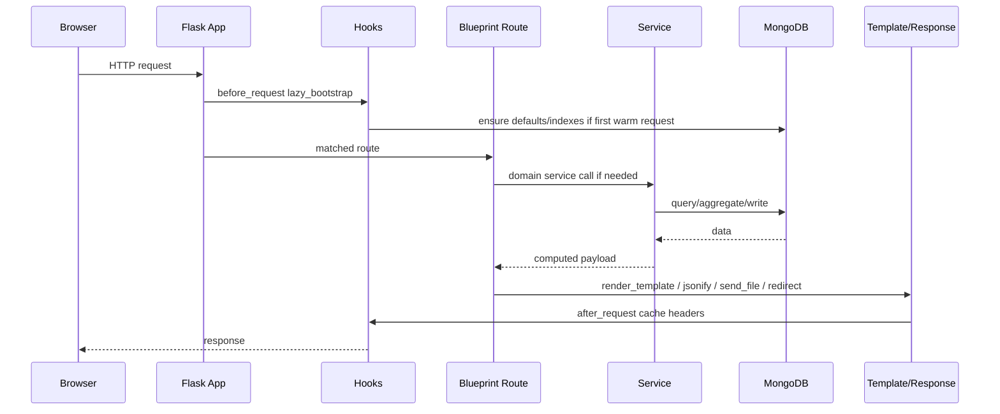

### Static Assets Flow

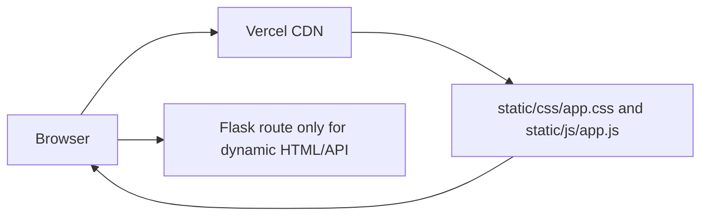

### API Communication Flow

Client-side AJAX endpoints:

| JS Caller | Endpoint | Purpose |
|---|---|---|
| Student form | `/students/fee-structures` | Load available structures for year/class |
| Student form | `/students/fee-lookup` | Resolve fee totals/details |
| Report student selector | `/students/api/by-grade/<grade>` | Load students by class |
| Receipt filters | `/receipts/api/students` | Load students for filters or modal |
| Receipt modal | `/receipts/api/student/<student_id>` | Load fee/payment state for receipt preview |
| Student profile drawer | `/students/<student_id>/api` | Load profile, fees, payments, history |
| Bulk promotion modal | `/students/api/eligible` | Load eligible students by year/class |

### Deployment/Runtime Architecture

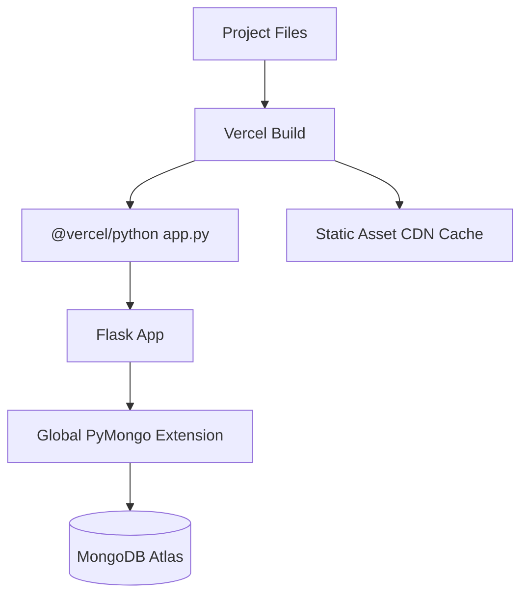

---

## 3. Complete Routes Analysis

### Route Inventory

| Route | Methods | Blueprint | Function | Auth | Template/Response |
|---|---|---|---|---|---|
| `/login` | GET, POST | `auth` | `login` | No | `auth/login.html` or redirect |
| `/logout` | GET | `auth` | `logout` | No | Redirect |
| `/` | GET | `dashboard` | `index` | Yes | `dashboard/index.html` |
| `/set-year` | POST | `dashboard` | `set_year` | Yes | Redirect |
| `/dashboard/payment-mode-export/<fmt>` | GET | `dashboard` | `payment_mode_export` | Yes | PDF/XLSX |
| `/fee-structure/` | GET | `fees` | `index` | Yes | `fee_structure/index.html` |
| `/fee-structure/<item_id>/edit` | GET | `fees` | `edit` | Yes | `fee_structure/index.html` |
| `/fee-structure/save` | POST | `fees` | `save` | Yes | Redirect |
| `/fee-structure/<item_id>/delete` | POST | `fees` | `delete` | Yes | Redirect |
| `/fee-structure/api/list` | GET | `fees` | `api_list` | Yes | JSON |
| `/students/` | GET | `students` | `index` | Yes | `students/index.html` |
| `/students/add` | GET, POST | `students` | `add` | Yes | Form/redirect |
| `/students/<student_id>` | GET | `students` | `view` | Yes | `students/view.html` |
| `/students/<student_id>/edit` | GET, POST | `students` | `edit` | Yes | Form/redirect |
| `/students/<student_id>/delete` | POST | `students` | `delete` | Yes | Redirect |
| `/students/<student_id>/api` | GET | `students` | `profile_api` | Yes | JSON |
| `/students/<student_id>/promote` | POST | `students` | `promote` | Yes | Redirect |
| `/students/<student_id>/mark-left` | POST | `students` | `mark_left` | Yes | Redirect |
| `/students/bulk-promote` | POST | `students` | `bulk_promote` | Yes | Redirect |
| `/students/api/eligible` | GET | `students` | `eligible_students` | Yes | JSON |
| `/students/fee-lookup` | GET | `students` | `fee_lookup` | Yes | JSON |
| `/students/fee-structures` | GET | `students` | `fee_structures` | Yes | JSON |
| `/students/api/by-grade/<grade>` | GET | `students` | `by_grade` | Yes | JSON |
| `/receipts/` | GET, POST | `receipts` | `index` | Yes | `receipts/index.html` |
| `/receipts/save/<student_id>` | POST | `receipts` | `save` | Yes | Redirect |
| `/receipts/create` | POST | `receipts` | `create` | Yes | Redirect |
| `/receipts/delete/<receipt_no>` | POST | `receipts` | `delete` | Yes | Redirect |
| `/receipts/api/students` | GET | `receipts` | `api_students` | Yes | JSON |
| `/receipts/api/student/<student_id>` | GET | `receipts` | `api_student` | Yes | JSON |
| `/receipts/print/<receipt_no>` | GET | `receipts` | `print_receipt` | Yes | `receipts/print.html` |
| `/receipts/pdf/<receipt_no>` | GET | `receipts` | `pdf` | Yes | PDF |
| `/reports/` | GET | `reports` | `index` | Yes | `reports/index.html` |
| `/reports/summary` | GET | `reports` | `summary` | Yes | `reports/summary.html` |
| `/reports/admissions` | GET | `reports` | `admissions` | Yes | `reports/admissions.html` |
| `/reports/receivable` | GET | `reports` | `receivable` | Yes | `reports/receivable.html` |
| `/reports/collections` | GET | `reports` | `collections` | Yes | `reports/collections.html` |
| `/reports/discounts` | GET | `reports` | `discounts` | Yes | `reports/discounts.html` |
| `/reports/fee-structure` | GET | `reports` | `fee_structure` | Yes | `reports/fee_structure.html` |
| `/reports/student-wise` | GET, POST | `reports` | `student_wise` | Yes | `reports/student_wise.html` |
| `/reports/date-wise-collections` | GET | `reports` | `date_wise_collections` | Yes | `reports/date_wise_collections.html` |
| `/reports/class-wise-pending` | GET | `reports` | `class_wise_pending` | Yes | `reports/class_wise_pending.html` |
| `/reports/receipt-history` | GET | `reports` | `receipt_history` | Yes | `reports/receipt_history.html` |
| `/reports/payment-mode-summary` | GET | `reports` | `payment_mode_summary` | Yes | `reports/payment_mode_summary.html` |
| `/reports/student-wise/pdf/<student_id>` | GET | `reports` | `student_wise_pdf` | Yes | PDF |
| `/reports/export/<report_name>/<fmt>` | GET | `reports` | `export` | Yes | PDF/XLSX |

### Route Details

<details>
<summary>Authentication Routes</summary>

#### `/login` - `routes/auth_routes.py:login`

- Methods: `GET`, `POST`
- Auth: public
- Request fields:
  - `username`
  - `password`
- DB:
  - `users.find_one({"username": ...}, {"username": 1, "password_hash": 1, "full_name": 1})`
- Success:
  - Sets `session["user_id"]`, `session["username"]`, `session["full_name"]`
  - Redirects to `next` query parameter or dashboard
- Failure:
  - Flash "Invalid username or password"
  - Renders login template
- Security notes:
  - No rate limiting.
  - `next` redirect accepts a request argument; validate local-only redirects in future.

#### `/logout` - `routes/auth_routes.py:logout`

- Methods: `GET`
- Auth: public
- Behavior:
  - Clears session.
  - Redirects to login.

</details>

<details>
<summary>Dashboard Routes</summary>

#### `/` - `routes/dashboard_routes.py:index`

- Methods: `GET`
- Auth: required
- Query parameters:
  - `academic_year`
  - `date_from`
  - `date_to`
  - `grade`
  - `month`
- Services:
  - `admissions_summary`
  - `add_admission_totals`
  - `dashboard_stats`
  - `financial_by_type`
  - `payment_mode_dashboard_summary`
- DB:
  - `students`, `payments`, `receipts`
  - Multiple aggregation pipelines in `report_service.py`
- Template:
  - `dashboard/index.html`
- Frontend:
  - Chart data is emitted into `window.dashboardPaymentModes` and `window.dashboardPaymentTrend`.
  - `static/js/app.js` initializes charts if `window.Chart` exists.
- Current payment-mode card behavior:
  - The dashboard always renders the fixed set of cards for Cash, UPI, Bank Transfer, Card, and Cheque.
  - Each card starts from zero and is populated dynamically from matching receipt data for the selected filters.
  - Payment modes outside the fixed card list are ignored for the cards.
  - Recent Transactions are read from the `receipts` collection; they are not hard-coded in `dashboard/index.html`.
- Failure mode:
  - Database aggregation errors would produce route failure.

#### `/set-year` - `routes/dashboard_routes.py:set_year`

- Methods: `POST`
- Auth: required
- Form field:
  - `academic_year`
- Behavior:
  - Sets `session["academic_year"]`.
  - Redirects to `request.referrer` or dashboard.
- Security note:
  - Referrer-based redirect is mostly browser-controlled; prefer local fallback validation in future.

#### `/dashboard/payment-mode-export/<fmt>`

- Methods: `GET`
- Auth: required
- Path parameter:
  - `fmt`: expected `pdf` or any non-`pdf` treated as XLSX
- Services:
  - `payment_mode_dashboard_summary`
- Output:
  - PDF via `simple_pdf`
  - XLSX via `openpyxl`

</details>

<details>
<summary>Fee Structure Routes</summary>

#### `/fee-structure/` - `fee_routes.index`

- Methods: `GET`
- Auth: required
- Query:
  - `academic_year`
- DB:
  - `fee_structures.find({"academic_year": selected_year}, projection).sort(...)`
- Template:
  - `fee_structure/index.html`
- UI:
  - Year dropdown filter.
  - Dynamic fee-head builder.
  - Saved structures table.

#### `/fee-structure/<item_id>/edit` - `fee_routes.edit`

- Methods: `GET`
- Auth: required
- Path:
  - `item_id`
- DB:
  - Fetches current-year rows.
  - Fetches `edit_row` by `_id`.
- Template:
  - `fee_structure/index.html` with edit mode.

#### `/fee-structure/save` - `fee_routes.save`

- Methods: `POST`
- Auth: required
- Form fields:
  - `id`
  - `academic_year`
  - `grade`
  - `fee_structure_name`
  - `fee_structure_type`
  - `student_type`
  - `description`
  - repeated `fee_head_name`
  - repeated `fee_head_amount`
- Service:
  - `build_fee_structure`
  - `sync_students_with_fee_structure`
- DB writes:
  - Update existing `fee_structures` by `_id`, or insert new.
  - Bulk-sync matching non-manual students.
- Success:
  - Flash success.
  - Redirects to fee structure index.
- Validation:
  - Client prevents duplicate fee names.
  - Backend normalizes and deduplicates fee heads.

#### `/fee-structure/<item_id>/delete`

- Methods: `POST`
- Auth: required
- DB:
  - Deletes one fee structure by `_id`.
- Risk:
  - No check for assigned students before deletion.

#### `/fee-structure/api/list`

- Methods: `GET`
- Auth: required
- Query:
  - `academic_year`
  - `grade`
- DB:
  - `fee_structures.find(query, projection).limit(500)`
- Response:
  - JSON list of structures.

</details>

<details>
<summary>Student Routes</summary>

#### `/students/` - `student_routes.index`

- Methods: `GET`
- Auth: required
- Query:
  - `academic_year`
  - `q`
  - `grade`
  - `status`
  - `student_type`
  - `due_status`
  - `page`
- DB:
  - `students.find(query, projection).sort("student_name")`
  - `_student_stats(year)` uses aggregations.
- Template:
  - `students/index.html`
- UI:
  - Stat cards, search/filter toolbar, paginated student table, profile drawer, promotion/left/bulk modals.
- Risk:
  - Due-status filtering happens after fetching all matching rows for year/filter, then slices in Python.

#### `/students/add` - `student_routes.add`

- Methods: `GET`, `POST`
- Auth: required
- GET:
  - Renders `students/form.html`.
- POST form:
  - Basic, academic, parent, fee, manual fee-head, discount fields.
- Services:
  - `_student_payload`
  - `build_student_fee`
  - `_save_photo`
  - `update_student_payment_summary`
- DB:
  - Inserts into `students`.
  - May upload photo to `static/uploads`.
- Success:
  - Redirects to students index.

#### `/students/<student_id>` - `student_routes.view`

- Methods: `GET`
- Auth: required
- DB:
  - Student by `_id`.
  - Payments by `student_id`.
- Service:
  - `effective_fee_for_student`
- Template:
  - `students/view.html`

#### `/students/<student_id>/edit`

- Methods: `GET`, `POST`
- Auth: required
- GET:
  - Fetches student and renders form.
- POST:
  - Builds payload.
  - Preserves existing `total_paid` if absent from form.
  - Rebuilds fee data.
  - Updates student.
  - Recalculates payment summary.
- Success:
  - Redirects to student view.

#### `/students/<student_id>/delete`

- Methods: `POST`
- Auth: required
- DB:
  - Deletes student.
  - Deletes linked payments.
- Risk:
  - Does not delete receipts or discounts linked to the student, so orphan receipt/discount records can remain.

#### `/students/<student_id>/api`

- Methods: `GET`
- Auth: required
- DB:
  - Student by `_id`.
  - Recent payments by `student_id`.
  - Academic history by admission number.
- Service:
  - `effective_fee_for_student`
- Response:
  - Student profile JSON, fee summary, payments, academic history.
- Frontend:
  - Offcanvas drawer in `students/index.html`.

#### `/students/<student_id>/promote`

- Methods: `POST`
- Auth: required
- Form:
  - `next_academic_year`
  - `promote_to_grade`
  - `remarks`
  - `keep_existing_fee_structure`
  - optional `assigned_fee_structure_id`
  - optional `assigned_fee_structure_year`
- DB:
  - Checks duplicate promoted record.
  - Inserts promoted student copy.
  - Updates original as `Promoted`.
- Service:
  - `_promoted_student_payload`
  - `build_student_fee`
  - `effective_fee_for_student`
  - `update_student_payment_summary`
- Business behavior:
  - Default keeps existing assigned/manual fee structure.
  - If unchecked, assigns selected/new structure.

#### `/students/<student_id>/mark-left`

- Methods: `POST`
- Auth: required
- Form:
  - `left_date`
  - `left_reason`
  - `tc_issued`
  - `remarks`
- DB:
  - Updates student status to `Left`.

#### `/students/bulk-promote`

- Methods: `POST`
- Auth: required
- Form:
  - `current_academic_year`
  - `next_academic_year`
  - `current_grade`
  - `next_grade`
  - repeated `student_ids`
- DB:
  - Loops over selected students.
  - Creates promoted records.
  - Updates originals.
- Risk:
  - Per-student inserts/updates; not transactional.

#### Student JSON Helpers

| Endpoint | Purpose |
|---|---|
| `/students/api/eligible` | Bulk promotion eligible student list |
| `/students/fee-lookup` | Fee data for selected structure/year/class/type |
| `/students/fee-structures` | Available fee structures list |
| `/students/api/by-grade/<grade>` | Student dropdown for reports |

</details>

<details>
<summary>Receipt Routes</summary>

#### `/receipts/` - `receipt_routes.index`

- Methods: `GET`, `POST`
- Auth: required
- Query/form:
  - `search`
  - `receipt_search`
  - `grade`
  - `student_id`
  - `payment_mode`
  - `date_from`
  - `date_to`
  - `page`
- DB:
  - Search selected student.
  - Query receipts with filters and pagination.
  - Receipt summary via aggregation.
  - Filter-student dropdown list.
- Template:
  - `receipts/index.html`
- Frontend:
  - Receipt modal uses `/receipts/api/students` and `/receipts/api/student/<id>`.

#### `/receipts/save/<student_id>`

- Methods: `POST`
- Auth: required
- DB:
  - Fetches student.
- Service:
  - `create_receipt`
- Success:
  - Redirects to receipt print page.
- Failure:
  - Flash error and redirect to receipts index with search.

#### `/receipts/create`

- Methods: `POST`
- Auth: required
- Form:
  - `student_id`
  - `academic_year`
  - `grade`
  - `current_payment`
  - `discount`
  - `payment_mode`
  - `transaction_ref`
  - `cheque_no`
  - `receipt_date`
  - `remarks`
- Service:
  - `create_receipt`
- DB writes:
  - `receipts.insert_one`
  - `payments.insert_one`
  - optional `discounts.insert_one`
  - `students.update_one` payment summary

#### `/receipts/delete/<receipt_no>`

- Methods: `POST`
- Auth: required
- Service:
  - `delete_receipt`
- DB writes:
  - Deletes matching receipt/payment records.
  - Deletes linked discount entry by reason.
  - Adjusts student discount if needed.
  - Recalculates student summary.

#### Receipt APIs

| Endpoint | Purpose | Collections |
|---|---|---|
| `/receipts/api/students` | Student dropdown by year/class | `students` |
| `/receipts/api/student/<student_id>` | Receipt modal fee/payment data | `students`, `fee_structures` |

#### Print/PDF

| Route | Output | Template/Utility |
|---|---|---|
| `/receipts/print/<receipt_no>` | HTML receipt | `receipts/print.html` |
| `/receipts/pdf/<receipt_no>` | PDF | `receipt_pdf` |

</details>

<details>
<summary>Report Routes</summary>

All report routes require login and use `active_year()` or the `academic_year` query parameter.

| Route | Service/Data | Template |
|---|---|---|
| `/reports/` | Static report menu | `reports/index.html` |
| `/reports/summary` | admissions + financial summary | `reports/summary.html` |
| `/reports/admissions` | admissions summary | `reports/admissions.html` |
| `/reports/receivable` | financial by grade/type | `reports/receivable.html` |
| `/reports/collections` | collection by type/grade | `reports/collections.html` |
| `/reports/discounts` | discounts by grade | `reports/discounts.html` |
| `/reports/fee-structure` | fee structures | `reports/fee_structure.html` |
| `/reports/student-wise` | student ledger | `reports/student_wise.html` |
| `/reports/date-wise-collections` | payment aggregation by date | `reports/date_wise_collections.html` |
| `/reports/class-wise-pending` | pending dues by class | `reports/class_wise_pending.html` |
| `/reports/receipt-history` | paginated receipt history | `reports/receipt_history.html` |
| `/reports/payment-mode-summary` | payment mode summary | `reports/payment_mode_summary.html` |
| `/reports/student-wise/pdf/<student_id>` | student PDF | `simple_pdf` |
| `/reports/export/<report_name>/<fmt>` | generic PDF/XLSX export | `simple_pdf`, `openpyxl` |

Export data is built by `_export_data(report_name, year)`.

</details>

### Route Dependency Graph

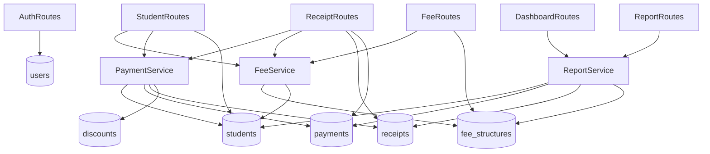

---

## 4. Complete Feature Breakdown

### Dashboard

| Item | Details |
|---|---|
| Purpose | Finance and admissions overview for the selected academic year |
| Files | `routes/dashboard_routes.py`, `services/report_service.py`, `templates/dashboard/index.html`, `static/js/app.js` |
| Collections | `students`, `payments`, `receipts` |
| UI | Summary cards, admissions tables, payment-mode cards, filters, charts, recent payments |
| Business logic | Aggregates students, admissions, receivables, collections, balances, and payment modes. Payment-mode cards retain the fixed Cash/UPI/Bank Transfer/Card/Cheque options but their totals are dynamically aggregated from receipts. |
| Edge cases | Empty datasets, missing Chart.js, missing payment mode |
| Scalability concerns | Payment trend aggregation scans receipts for the year; acceptable with indexes but can grow |
| Security concerns | Export endpoint accepts `<fmt>` without strict enum validation |

### Students

| Item | Details |
|---|---|
| Purpose | Manage student master records and lifecycle |
| Files | `routes/student_routes.py`, `templates/students/*`, `services/fee_service.py`, `services/payment_service.py` |
| Collections | `students`, `payments`, `fee_structures` |
| UI | Student list, filters, profile drawer, add/edit form, lifecycle modals |
| Business logic | Fee assignment, total/due calculation, promotion, mark-left, delete |
| Validation | Required fields in HTML, route-level existence checks, duplicate promotion check |
| Edge cases | Orphan receipts after student delete, duplicate admission numbers not globally prevented |
| Failure points | Invalid ObjectId produces `None` query, missing photo folder, DB write failures |

### Fee Structure

| Item | Details |
|---|---|
| Purpose | Reusable class/year fee plans and custom structures |
| Files | `routes/fee_routes.py`, `services/fee_service.py`, `templates/fee_structure/index.html` |
| Collections | `fee_structures`, `students` |
| UI | Dynamic fee-head builder with add/delete/reorder, sticky summary |
| Business logic | Saves dynamic `fee_heads`; maps known heads into legacy fields for compatibility |
| Edge cases | Duplicate fee names are normalized out by backend; custom fee names do not map to legacy columns |
| Failure points | Deleting assigned structures can leave students referencing a missing structure |

### Student Fee Assignment

| Item | Details |
|---|---|
| Purpose | Assign old/current structures or create per-student manual fees |
| Files | `templates/students/form.html`, `static/js/app.js`, `services/fee_service.py`, `routes/student_routes.py` |
| Collections | `students`, `fee_structures` |
| UI | Mode dropdown, academic-year dropdown, structure dropdown, manual builder |
| Business logic | Existing mode stores `assigned_fee_structure_id/year`; manual mode stores `manual_fee_structure` |
| Edge cases | Manual names that match legacy names map to old columns; unknown names only appear in dynamic heads |

### Receipts And Fee Collection

| Item | Details |
|---|---|
| Purpose | Record fee payments and generate receipts |
| Files | `routes/receipt_routes.py`, `services/payment_service.py`, `templates/receipts/*`, `utils/pdf_generator.py` |
| Collections | `students`, `receipts`, `payments`, `discounts`, `fee_structures` |
| UI | Receipt history, filters, modal, preview, print/PDF |
| Business logic | Prevents zero/negative and over-pending payments, handles optional receipt discount |
| Edge cases | Receipt and payment inserts are not transactional; partial failure can desync |

### Reports

| Item | Details |
|---|---|
| Purpose | Printable/exportable finance and admissions reports |
| Files | `routes/report_routes.py`, `services/report_service.py`, `templates/reports/*` |
| Collections | `students`, `payments`, `receipts`, `fee_structures` |
| UI | Report index cards, report tables, print/export actions |
| Business logic | Aggregates admissions, receivable, collections, dues, discounts, history |
| Edge cases | Export limits receipt history to 5000 rows; report pages depend on stored summary fields |

### Academic Year

| Item | Details |
|---|---|
| Purpose | Segment records and support historical fees |
| Files | `utils/helpers.py`, `templates/base.html`, route query params |
| Collections | `academic_years`, plus distinct years from domain collections |
| UI | Topbar year switcher and module-specific year filters |
| Business logic | `active_year()` reads session or config default |
| Edge cases | Generated years include past/future windows, may show years with no data |

### Promotion System

| Item | Details |
|---|---|
| Purpose | Preserve old records and create next-year records |
| Files | `routes/student_routes.py`, `templates/students/index.html`, `static/js/app.js` |
| Collections | `students` |
| Business logic | New record copies student data, resets payments, stores `promoted_from`, updates old record |
| Edge cases | Not transactional; bulk promotion can partially complete |

### Export/PDF

| Item | Details |
|---|---|
| Purpose | Printable/PDF/XLSX reporting |
| Files | `utils/pdf_generator.py`, `routes/report_routes.py`, `routes/dashboard_routes.py`, `routes/receipt_routes.py` |
| Libraries | ReportLab, OpenPyXL |
| Edge cases | Large exports can exceed Vercel memory/time |

### Notifications

Flash messages are rendered as Bootstrap toasts in `base.html`. No persistent notification system exists.

### Inventory/User Roles/Settings

No inventory module, explicit role model, or settings module exists in the scanned project.

---

## 5. Complete Database Analysis

### Inferred Collections And Schemas

#### `users`

```json
{
  "_id": "ObjectId",
  "username": "admin",
  "password_hash": "...",
  "full_name": "Administrator",
  "created_at": "datetime"
}
```

#### `academic_years`

```json
{
  "_id": "ObjectId",
  "name": "2026-27",
  "is_active": true
}
```

#### `students`

```json
{
  "_id": "ObjectId",
  "admission_no": "string",
  "roll_no": "string",
  "student_name": "string",
  "gender": "Male/Female",
  "dob": "YYYY-MM-DD",
  "academic_year": "2026-27",
  "grade": "Grade-VIII",
  "current_grade": "Grade-VIII",
  "previous_grade": "Grade-VII",
  "status": "Active/Promoted/Left/Alumni",
  "student_status": "Old/New",
  "student_type": "Day Scholar/Residential",
  "father_name": "string",
  "mother_name": "string",
  "mobile": "string",
  "alternate_number": "string",
  "address": "string",
  "fee_structure_mode": "existing/manual",
  "assigned_fee_structure_id": "string",
  "assigned_fee_structure_year": "2023-24",
  "manual_fee_structure": {
    "fee_heads": [{"name": "Tuition Fee", "amount": 25000}],
    "total_amount": 25000
  },
  "fee_heads": [{"name": "Tuition Fee", "amount": 25000}],
  "tuition_fee": 0,
  "books_fee": 0,
  "uniform_fee": 0,
  "lab_fee": 0,
  "transport_fee": 0,
  "hostel_fee": 0,
  "other_fee": 0,
  "total_fee": 0,
  "total_amount": 0,
  "discount_amount": 0,
  "discount_reason": "string",
  "net_receivable": 0,
  "total_paid": 0,
  "balance_due": 0,
  "promoted_from": "student_id",
  "promoted_to": "student_id",
  "promotion_date": "datetime",
  "promotion_remarks": "string",
  "left_date": "YYYY-MM-DD",
  "left_reason": "string",
  "tc_issued": true,
  "left_remarks": "string",
  "photo": "filename",
  "created_at": "datetime",
  "updated_at": "datetime"
}
```

#### `fee_structures`

```json
{
  "_id": "ObjectId",
  "academic_year": "2025-26",
  "grade": "Grade-VIII",
  "class_name": "Grade-VIII",
  "student_type": "Day Scholar",
  "fee_structure_name": "Grade 8 Standard",
  "fee_structure_type": "standard/manual",
  "description": "string",
  "fee_heads": [{"name": "Tuition Fee", "amount": 25000}],
  "total_amount": 37000,
  "total_fee": 37000,
  "tuition_fee": 25000,
  "books_fee": 0,
  "uniform_fee": 0,
  "lab_fee": 0,
  "transport_fee": 12000,
  "hostel_fee": 0,
  "other_fee": 0,
  "created_at": "datetime",
  "updated_at": "datetime"
}
```

#### `receipts`

Current data note:

- Dashboard Recent Transactions are live MongoDB records from `receipts`, not hard-coded UI values.
- Demo-like records `REC-2026-0001` (`Abc`, Cash, 20000) and `REC-2026-9281` (`Sai Verma`, UPI, 20000) were removed from `receipts` and `payments` through `delete_receipt`.

```json
{
  "_id": "ObjectId",
  "receipt_no": "REC-2026-0001",
  "student_id": "string",
  "student_name": "string",
  "class_name": "Grade-VIII",
  "grade": "Grade-VIII",
  "admission_no": "string",
  "mobile": "string",
  "academic_year": "2026-27",
  "fee_structure_id": "string",
  "fee_structure_year": "2026-27",
  "fee_structure_mode": "existing/manual",
  "fee_heads": [],
  "total_fee": 0,
  "amount_paid_before": 0,
  "current_payment": 0,
  "discount": 0,
  "balance_due": 0,
  "payment_mode": "Cash/UPI/Bank Transfer/Card/Cheque",
  "transaction_ref": "string",
  "cheque_no": "string",
  "receipt_date": "YYYY-MM-DD",
  "remarks": "string",
  "created_at": "datetime"
}
```

#### `payments`

Current data note:

- The payment ledger rows paired with `REC-2026-0001` and `REC-2026-9281` were also removed during receipt cleanup.

```json
{
  "_id": "ObjectId",
  "receipt_no": "REC-2026-0001",
  "student_id": "string",
  "student_name": "string",
  "admission_no": "string",
  "grade": "Grade-VIII",
  "academic_year": "2026-27",
  "receipt_date": "YYYY-MM-DD",
  "amount_paid": 0,
  "payment_mode": "Cash",
  "cheque_no": "string",
  "remarks": "string",
  "created_at": "datetime"
}
```

#### `discounts`

```json
{
  "_id": "ObjectId",
  "student_id": "string",
  "student_name": "string",
  "grade": "Grade-VIII",
  "academic_year": "2026-27",
  "amount": 0,
  "reason": "Receipt REC-2026-0001",
  "created_at": "datetime"
}
```

### Relationships

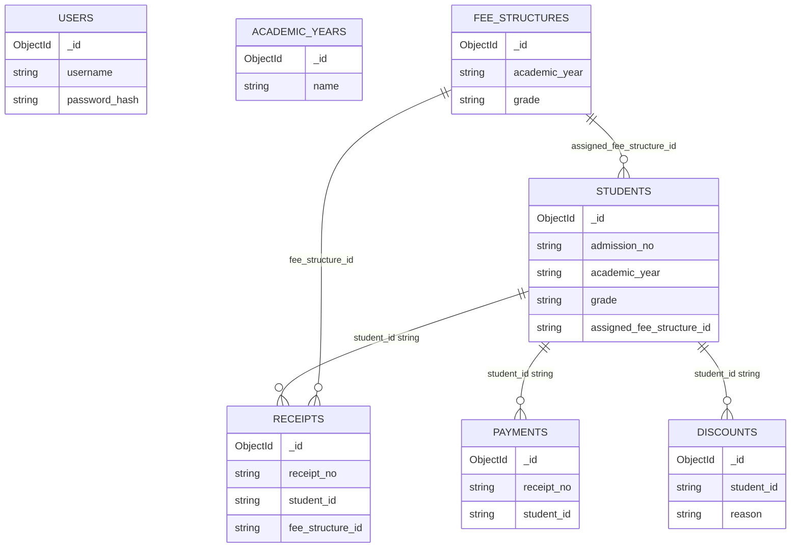

### Indexed Fields

Indexes created lazily by `utils/performance.py`:

| Collection | Index |
|---|---|
| students | `academic_year, grade, student_name` |
| students | `academic_year, status, grade` |
| students | `academic_year, student_type, grade` |
| students | `admission_no, academic_year, grade` |
| students | `assigned_fee_structure_id, assigned_fee_structure_year` |
| receipts | `academic_year, created_at desc` |
| receipts | `academic_year, grade, receipt_date desc` |
| receipts | `academic_year, student_id, receipt_date desc` |
| receipts | `academic_year, payment_mode, receipt_date desc` |
| receipts | `fee_structure_id, academic_year` |
| receipts | `receipt_no` |
| payments | `academic_year, student_id, receipt_date desc` |
| payments | `academic_year, grade, receipt_date desc` |
| payments | `academic_year, payment_mode, receipt_date desc` |
| payments | `receipt_no` |
| fee_structures | `academic_year, grade, student_type` |
| fee_structures | `academic_year, created_at desc` |
| users | `username` |

### Missing Or Potential Future Indexes

| Severity | Field/Pattern | Reason |
|---|---|---|
| MEDIUM | `students.student_name` text/search | Regex search on name can still scan within year |
| MEDIUM | `students.mobile` | Receipt/student search includes mobile |
| MEDIUM | `receipts.student_name`, `receipts.mobile` | Receipt search uses regex fields |
| LOW | `discounts.student_id`, `discounts.academic_year` | Future discount reports may need this |
| LOW | `students.status, academic_year` reversed variants | Current compound index probably adequate |

### Duplicate Data Risks

| Risk | Description |
|---|---|
| Student fee snapshot duplication | Students store copied fee fields and dynamic heads, while structures remain separate. This is useful for snapshots but can diverge. |
| Receipts/payments duplication | Each receipt creates both a receipt and a payment record. Partial writes can desync. |
| Discount duplication | Receipt discount increments `students.discount_amount` and inserts a `discounts` record. |
| Grade/class duplicated | `grade` and `class_name` both exist in fee/receipt structures. |

### Atomicity Risks

| Severity | Operation | Risk |
|---|---|---|
| HIGH | `create_receipt` | Inserts receipt, payment, optional discount, and student update without transaction |
| HIGH | `delete_receipt` | Deletes/updates multiple collections without transaction |
| MEDIUM | Promotion | Inserts new student then updates old student separately |
| MEDIUM | Bulk promotion | Partial batch completion possible |
| MEDIUM | Fee structure sync | Bulk update is efficient but not transaction-bound with structure update |

### N+1 Query Risks

| Location | Status |
|---|---|
| Reports | Mostly aggregation-based now |
| Student profile drawer | One student, payments, and history per drawer open; acceptable |
| Bulk promotion | Per-selected-student reads/writes; N+1 for large batches |
| Fee structure sync | One bulk write after one cursor; acceptable |

---

## 6. Complete Frontend Analysis

### Templates

| Template | Purpose |
|---|---|
| `base.html` | Shared layout, navigation, year switcher, flash toasts, CSS/JS includes |
| `auth/login.html` | Login page |
| `dashboard/index.html` | Analytics dashboard |
| `fee_structure/index.html` | Fee structure builder and list |
| `students/index.html` | Student table, filters, profile drawer, lifecycle modals |
| `students/form.html` | Add/edit student, fee assignment/manual fee builder |
| `students/view.html` | Student details and payments |
| `receipts/index.html` | Receipt history, filters, modal creation |
| `receipts/print.html` | Printable receipt |
| `reports/index.html` | Report landing page |
| `reports/_actions.html` | Print/export buttons |
| `reports/*.html` | Specific reports |

No unused templates were detected by route/template references in the scanned project.

### Navigation Flow

`base.html` sidebar links:

```text
Dashboard -> Students -> Fee Structure -> Receipts -> Reports -> Logout
```

Topbar academic-year switcher posts to `/set-year`.

### CSS Structure

`static/css/app.css` is a single large stylesheet containing:

- Root/theme/layout styles.
- Sidebar/topbar styles.
- Dashboard cards and report styles.
- Receipt modal/history styles.
- Student module styles.
- Fee builder styles.
- Responsive media queries.

Potential concerns:

- Single 44KB stylesheet can grow difficult to maintain.
- Some styles are module-specific but globally loaded.
- No CSS build/minification pipeline is present.

### JavaScript Architecture

`static/js/app.js` is a single DOMContentLoaded script using data attributes to activate:

| Area | Behavior |
|---|---|
| Sidebar | Open/close mobile sidebar |
| Fee builder | Add/remove/reorder fee heads, duplicate validation, totals |
| Student fee assignment | Load fee structures and fee lookup by year/class/type |
| Student reports | Load student dropdown by grade |
| Receipt filters | Load students by class |
| Receipt modal | Load student fee state and calculate payment preview |
| Dashboard charts | Render payment mode/trend charts if Chart.js is present |
| Student profile drawer | Load student profile API into offcanvas |
| Promotion modal | Set action, toggle fee structure fields |
| Mark-left modal | Set action and default date |
| Bulk promotion | Load eligible students and submit selected students |

### AJAX/API Calls

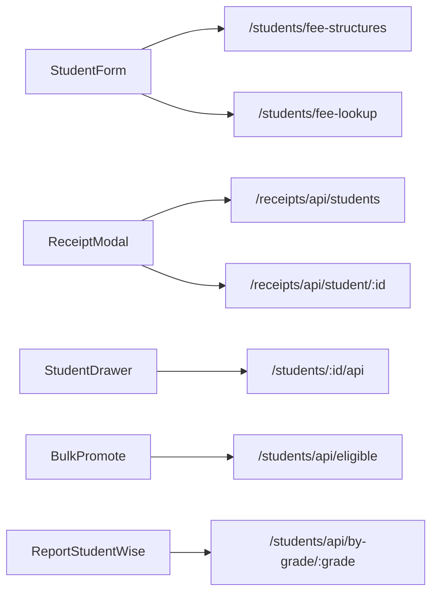

### Form Handling

Forms are standard server-submitted HTML forms. Critical forms:

- Login
- Academic year switcher
- Student add/edit
- Fee structure save
- Receipt create
- Student lifecycle modals
- Report filters

### Modal Flow

| Modal | Template | JS |
|---|---|---|
| Receipt creation | `receipts/index.html` | Loads students and fee data, validates payment |
| Promote student | `students/index.html` | Sets action and fee-structure toggle |
| Mark as left | `students/index.html` | Sets action/date |
| Bulk promote | `students/index.html` | Loads eligible students |

### Large Rendering Blocks

| Area | Risk |
|---|---|
| Students list | Page size is 12; safe |
| Receipt history | Page size is 10 in receipts, 100 in report; safe |
| Fee structures list | Could grow but likely manageable |
| Reports | Most are grouped summaries; safe |
| Bulk promotion checkbox list | Could become large for very large classes |

---

## 7. Complete User Flows

### Login Flow

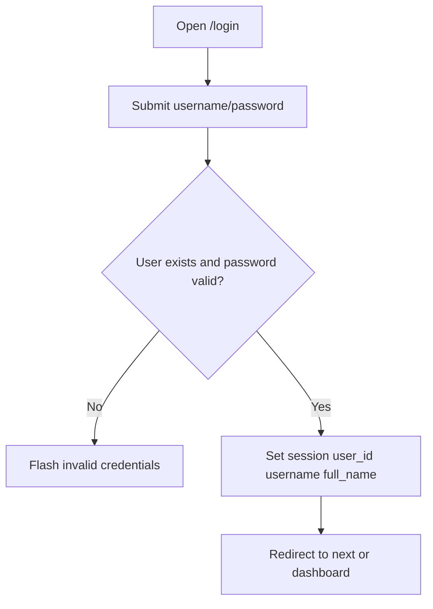

### Student Admission Flow

1. User opens `/students/add`.
2. Route renders `students/form.html`.
3. User enters basic, academic, parent, and fee details.
4. If existing fee mode:
   - Select academic year/class/type.
   - JS loads structures from `/students/fee-structures`.
   - JS resolves fee via `/students/fee-lookup`.
5. If manual fee mode:
   - User adds fee heads dynamically.
   - JS calculates total and validates duplicate names.
6. User submits form.
7. Route builds `_student_payload`.
8. `build_student_fee` resolves fee payload.
9. Optional photo is saved.
10. Student is inserted.
11. `update_student_payment_summary` recalculates totals.
12. Redirect to student list.

### Fee Collection Flow

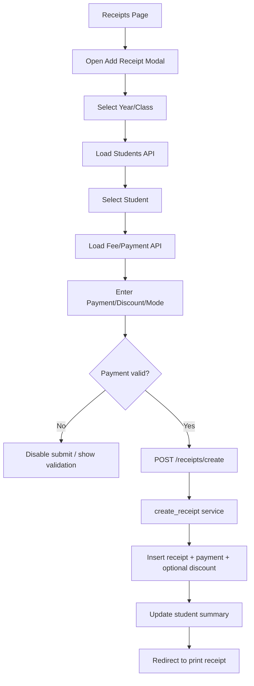

### Receipt Generation Flow

1. Receipt modal posts to `/receipts/create`.
2. Student is fetched.
3. `create_receipt` validates amount:
   - Must be greater than zero.
   - Cannot exceed pending due after discount.
4. `next_receipt_no` generates receipt number.
5. Receipt document inserted.
6. Payment document inserted.
7. Optional discount document inserted.
8. Student summary updated.
9. User redirected to `/receipts/print/<receipt_no>`.
10. PDF available at `/receipts/pdf/<receipt_no>`.

### Report Generation Flow

1. User opens `/reports`.
2. User selects a report page.
3. Route calls `report_service` aggregation/helper.
4. Template renders report table.
5. `_actions.html` provides print/PDF/XLSX exports.
6. Export route rebuilds report rows and streams PDF/XLSX.

### Student Promotion Flow

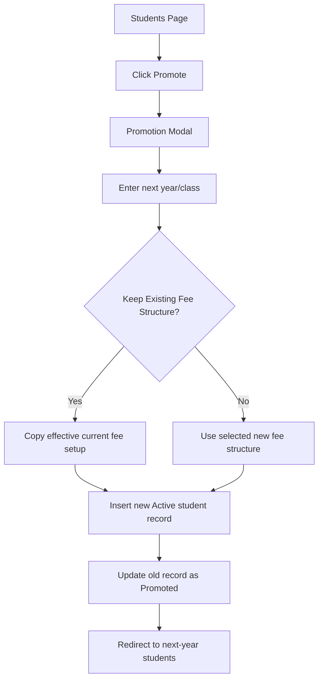

### Old Student Continuation Flow

1. Student has assigned old fee structure year/id.
2. During promotion, "Keep Existing Fee Structure" is checked by default.
3. New student record preserves assigned fee structure info or manual fee structure.
4. New record gets `student_status = "Old"` and `total_paid = 0`.
5. Old fee plan remains effective even in a new academic year.

### Manual Fee Structure Selection Flow

1. In Student Add/Edit, select "Create Manual Fee Structure".
2. Existing fee fields hide and manual builder appears.
3. User adds fee heads/amounts.
4. JS computes totals and duplicate warnings.
5. On submit, `build_student_fee` stores:
   - `fee_structure_mode = "manual"`
   - `manual_fee_structure.fee_heads`
   - `manual_fee_structure.total_amount`
   - `fee_heads`
   - `total_fee`
   - `net_receivable`

---

## 8. Performance Audit

| Severity | Area | Finding | Impact | Notes |
|---|---|---|---|---|
| HIGH | Receipt creation/deletion | Multi-collection writes are not transactional | Data consistency can fail under partial write errors | Use MongoDB sessions/transactions if Atlas tier supports it |
| HIGH | Bulk promotion | Per-student DB loop | Slow for very large batches | Bulk reads/writes would scale better |
| MEDIUM | Student index due filter | Fetches rows then filters due status in Python | More memory/CPU for large year datasets | Could push due filter into Mongo query |
| MEDIUM | Regex search | Regex over name/mobile can still scan | Slow with 10k+ records | Text indexes or normalized search fields recommended |
| MEDIUM | Exports | Large PDF/XLSX exports built in memory | Vercel memory/time risk | Stream or cap exports for very large datasets |
| MEDIUM | `next_receipt_no` | Reads latest receipt/payment by regex | Concurrency risk and potential duplicate numbers | Use counters collection/atomic increment |
| LOW | Single JS/CSS bundle | All pages load full app JS/CSS | Extra bytes on small pages | Split by module if app grows |
| LOW | Academic years helper | Distinct scans across collections, cached | Warm-cache good, cold-call can scan | Consider persisted years only |

### Slow Route Candidates

| Route | Reason |
|---|---|
| `/students/` | Python filtering for due statuses after Mongo fetch |
| `/students/bulk-promote` | Looped operations |
| `/receipts/create` | Multiple dependent writes |
| `/reports/export/<report_name>/<fmt>` | In-memory PDF/XLSX generation |
| `/dashboard/payment-mode-export/<fmt>` | In-memory export |

### Existing Optimizations Observed

- Projections on many list/API queries.
- Pagination on students, receipts, receipt history report.
- Aggregations for dashboard/report summaries.
- Lazy index creation.
- Warm-instance TTL cache.
- Vercel static caching.
- Deferred JS.
- Lazy heavy export imports.

---

## 9. Security Audit

| Severity | Area | Finding | Risk | Recommendation |
|---|---|---|---|---|
| CRITICAL | CSRF | POST forms do not include CSRF tokens | Authenticated state-changing requests are CSRF-prone | Add Flask-WTF CSRF or custom CSRF middleware |
| HIGH | Authorization | Only logged-in check; no role/permission model | Any logged-in user can delete/promote/export | Add roles/permissions if multi-user |
| HIGH | File upload | Photo upload accepts images but only uses filename sanitization | Malicious file content or extension ambiguity | Validate MIME, extension, image decoding, storage path |
| HIGH | Multi-write consistency | Receipt create/delete not transactional | Data inconsistency can be exploited or caused by failures | Use transactions or compensating writes |
| MEDIUM | Login | No rate limiting or lockout | Brute-force risk | Add rate limiting |
| MEDIUM | Redirects | Login `next` and dashboard referrer redirects are not strictly validated | Open redirect risk | Validate local paths only |
| MEDIUM | Secret key fallback | Default `dev-secret` if env missing | Session compromise in misconfigured prod | Require strong `SECRET_KEY` in prod |
| MEDIUM | Delete endpoints | No additional confirmation server-side | Accidental destructive operations | Soft-delete or audit logs |
| LOW | XSS | Jinja escapes by default; JS uses `escapeHtml` in profile drawer | Mostly controlled | Keep avoiding `|safe` for user content |
| LOW | Sensitive data | No obvious password exposure | Good | Ensure `.env` never committed |

### Authentication Weaknesses

- No password policy.
- No account lockout.
- No MFA.
- No role-level permissions.
- No server-side session store/revocation list.

### Form Handling Risks

Most validations rely on HTML controls and service checks. Server-side validation exists for receipt amount and some existence checks, but many student/fee fields accept free-form strings.

---

## 10. Code Quality And Maintainability

### Complexity Hotspots

| File | Concern |
|---|---|
| `routes/student_routes.py` | Large file, many responsibilities: CRUD, APIs, lifecycle, stats |
| `static/js/app.js` | Single large script controlling all modules |
| `static/css/app.css` | Single large stylesheet with all module styles |
| `services/report_service.py` | Many report aggregation functions and export dependencies |
| `services/fee_service.py` | Complex compatibility layer for dynamic and legacy fees |
| `routes/receipt_routes.py` | UI, filters, APIs, summaries, print/PDF in one file |

### Duplicate Logic

| Pattern | Files |
|---|---|
| Student/payment summary calculation | `payment_service.py`, route-level report calculations |
| Fee total/legacy field compatibility | `fee_service.py`, templates display legacy fields |
| Receipt/payment dual storage | `payment_service.py`, reports read both in different contexts |
| Year selection handling | `base.html`, fee page, student form, report routes |

### Tight Coupling

- Templates expect specific dict keys from route/service functions.
- `fee_service` knows legacy field names and dynamic head structure.
- `payment_service` depends on `fee_service.effective_fee_for_student`.
- Report routes depend on `report_service` data shapes.
- Client JS depends heavily on `data-*` attributes and exact API response keys.

### Dead/Unused Code Candidates

| Item | Note |
|---|---|
| `services.payment_service.create_payment` | Simple alias to `create_receipt`; may exist for backward compatibility |
| `services.report_service.fee_structure_map` | Less used after aggregation optimization, but still present |
| `services.report_service.payments` | General helper used less after aggregations |
| `templates/students/view.html` | Route exists and template used |

### Maintainability Risks

- No automated tests found.
- No schema validation layer.
- No database migrations.
- No transaction boundary abstraction.
- Single JS/CSS files will become harder to evolve.
- Business logic partly duplicated between stored snapshots and calculated effective fees.

---

## 11. Visual Documentation

### Application Architecture

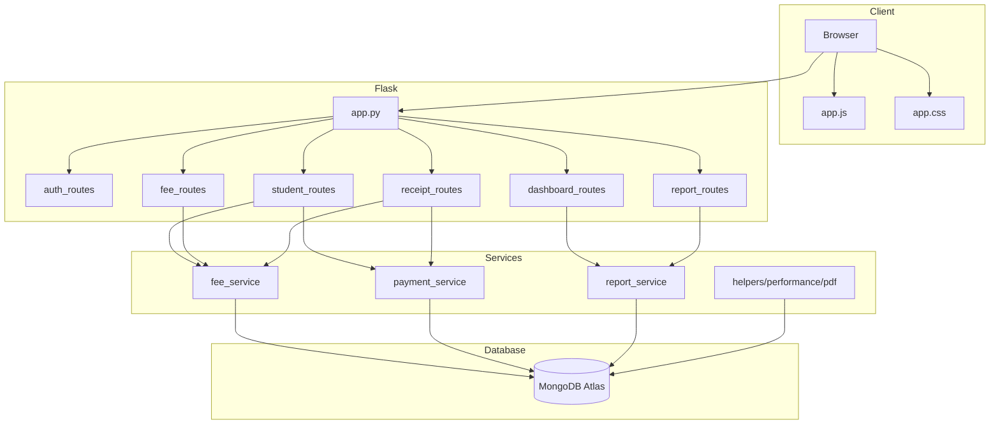

### Authentication Flow

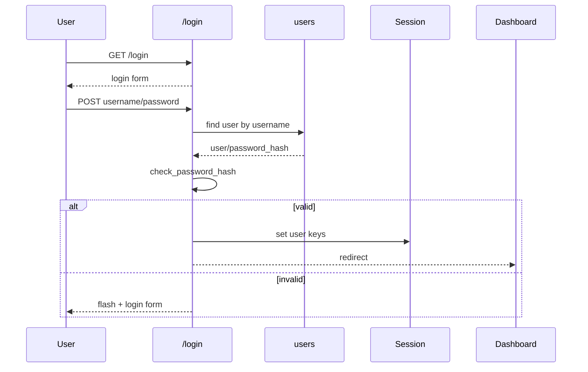

### Fee Resolution Flow

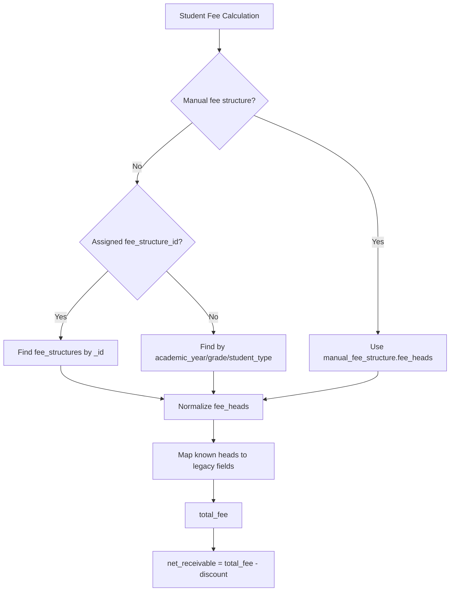

### Receipt Creation Flow

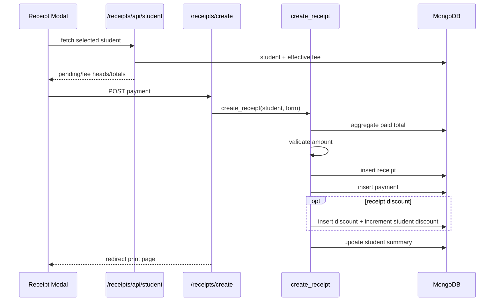

### Promotion Flow

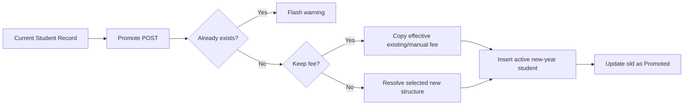

### Database Dependency Map

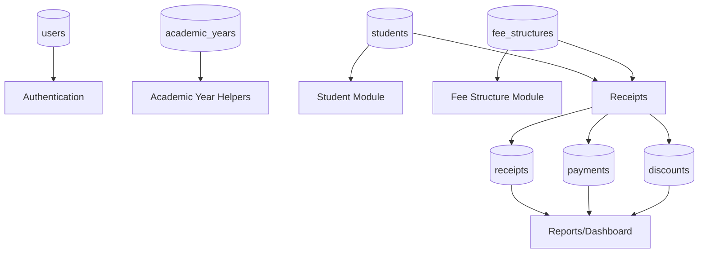

---

## 12. Final Technical Summary

### Biggest Strengths

- Clear module boundaries through Flask blueprints.
- Service layer exists for fee/payment/report logic.
- Dynamic fee-head support with backward compatibility for legacy columns.
- Student promotion preserves history instead of mutating old records.
- Receipt creation validates overpayment.
- Reporting coverage is broad.
- Vercel deployment config and lazy Mongo behavior are present.
- Many performance indexes and aggregations are already in place.

### Biggest Risks

| Severity | Risk |
|---|---|
| CRITICAL | Missing CSRF protection for all POST forms |
| HIGH | Multi-collection receipt/payment/discount writes are not transactional |
| HIGH | No authorization roles beyond login |
| HIGH | File upload validation is minimal |
| MEDIUM | Student delete can leave orphan receipts/discounts |
| MEDIUM | Receipt number generation can race under concurrent requests |
| MEDIUM | Large exports can exceed Vercel serverless limits |

### Most Fragile Modules

1. `services/payment_service.py` because it writes to receipts, payments, discounts, and students together.
2. `services/fee_service.py` because it must reconcile dynamic fee heads, manual structures, assigned structures, and legacy columns.
3. `routes/student_routes.py` because it combines CRUD, lifecycle, APIs, stats, file upload, and promotion behavior.
4. `services/report_service.py` because reports depend on stored financial snapshot fields being correct.

### Most Complex Flows

| Flow | Reason |
|---|---|
| Receipt creation/deletion | Multi-collection writes and recalculation |
| Student promotion | Copies records, fee state, lifecycle metadata |
| Manual fee assignment | Dynamic fee heads plus legacy compatibility |
| Dashboard reporting | Multiple aggregations and cached summaries |

### Scalability Concerns

- Bulk promotion is not optimized for very large batches.
- Regex search should evolve into normalized indexed search or Atlas Search.
- Export generation should be streamed or queued if data grows.
- Student due-status filtering should move fully into MongoDB queries.
- Receipt number generation should become atomic.

### Recommended Future Refactors

1. Add CSRF protection before expanding users/roles.
2. Add MongoDB transactions or a compensating write/audit strategy for receipt creation/deletion.
3. Introduce schema validation with Pydantic, Marshmallow, or MongoDB JSON Schema.
4. Split `student_routes.py` into CRUD, lifecycle, and API modules.
5. Split `app.js` and `app.css` by page/module as the UI grows.
6. Add tests for fee assignment, promotion, receipt validation, and reports.
7. Add audit logging for destructive actions.
8. Introduce atomic receipt counter collection.

### Recommended Optimization Priorities

| Priority | Recommendation |
|---|---|
| 1 | Push due-status filtering into Mongo queries |
| 2 | Add indexed normalized search fields |
| 3 | Optimize bulk promotion with bulk operations |
| 4 | Cap or stream large exports |
| 5 | Cache dashboard widgets by year/filter with explicit invalidation |

### Security Improvement Priorities

| Priority | Recommendation |
|---|---|
| 1 | Add CSRF tokens |
| 2 | Require strong production `SECRET_KEY` |
| 3 | Add login rate limiting |
| 4 | Add role/permission system |
| 5 | Harden file upload validation |
| 6 | Validate local redirects |
| 7 | Add audit logs for delete/promote/receipt actions |

### Scores

| Category | Score | Notes |
|---|---:|---|
| Maintainability | 7/10 | Good modular start, but some large coupled files |
| Scalability | 7/10 | Aggregations/indexes help; writes/export/search need more hardening |
| Code Quality | 7/10 | Clear procedural style, service layer present, limited validation/tests |
| Security | 5/10 | Basic auth exists, but CSRF/roles/rate limiting missing |
| Overall Architecture | 7/10 | Solid Flask monolith suitable for current scope, with known growth points |

---

## Appendix A: File Inventory

| Path | Role |
|---|---|
| `app.py` | Flask app factory, blueprint registration, hooks |
| `config.py` | Environment-driven app config |
| `extensions.py` | Global PyMongo extension |
| `vercel.json` | Vercel routing/function/static cache config |
| `requirements.txt` | Python dependencies |
| `routes/auth_routes.py` | Login/logout |
| `routes/dashboard_routes.py` | Dashboard and payment-mode export |
| `routes/fee_routes.py` | Fee structure CRUD/API |
| `routes/receipt_routes.py` | Receipt pages, APIs, print/PDF |
| `routes/report_routes.py` | Reports and exports |
| `routes/student_routes.py` | Student CRUD/lifecycle/APIs |
| `services/fee_service.py` | Fee calculation and structure logic |
| `services/payment_service.py` | Receipt/payment creation and recalculation |
| `services/report_service.py` | Report/dashboard aggregation logic |
| `utils/auth.py` | `login_required` decorator |
| `utils/helpers.py` | Constants, money/year helpers, defaults, receipt number |
| `utils/pdf_generator.py` | ReportLab PDF helpers |
| `utils/performance.py` | TTL cache and lazy indexes |
| `static/css/app.css` | Global styles |
| `static/js/app.js` | Global page behavior |
| `templates/base.html` | Shared layout |
| `templates/auth/login.html` | Login UI |
| `templates/dashboard/index.html` | Dashboard UI |
| `templates/fee_structure/index.html` | Fee structure UI |
| `templates/receipts/index.html` | Receipt UI |
| `templates/receipts/print.html` | Receipt print UI |
| `templates/reports/*` | Reports UI |
| `templates/students/*` | Students UI |

## Appendix B: Observed Collections

```text
academic_years
discounts
fee_structures
payments
receipts
students
users
```

## Appendix C: External Dependencies

| Dependency | Purpose |
|---|---|
| Flask | Web framework |
| Flask-Compress | Optional response compression |
| Flask-PyMongo | MongoDB integration |
| python-dotenv | Local environment loading |
| Werkzeug | Password hashing and upload filename sanitation |
| reportlab | PDF generation |
| openpyxl | Excel export |
| Bootstrap CDN | UI components |
| Bootstrap Icons CDN | Icons |
| Chart.js | Dashboard charts if available |
